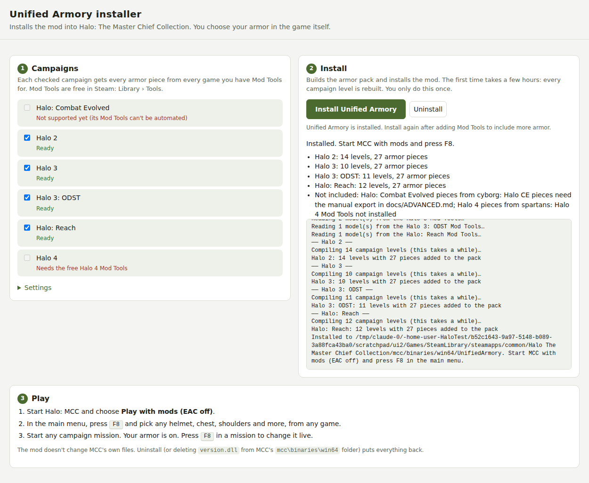

# Unified Armory

A mod for Halo: The Master Chief Collection: wear armor from **any** Halo game in **every** campaign, chosen **in-game**.

Press **F8** in MCC's main menu, pick, say, Reach's Gungnir helmet and Halo 3's EOD chest, then start any campaign mission in Halo 2, Halo 3, ODST, Reach or Halo 4 and you're wearing them. These are the real models from each game, fitted to every campaign's character. Change your mind mid-mission? Press F8 again; it updates live.

## Install (once)

1. **Download** `UnifiedArmory.zip` from the [Releases page](../../releases) and unzip it anywhere.
2. **Get the free Mod Tools** in Steam: open **Library**, switch the dropdown to **Tools**, and install the Mod Tools for the games you want. Every game you have Mod Tools for adds both its campaign and its armor to the mod. Halo 4 also needs [Blender](https://www.blender.org/download/) (free).
3. **Double-click `UnifiedArmory.exe`** and click **Install Unified Armory**. It finds MCC and the Mod Tools by itself, builds the armor pack and installs the mod. The first install rebuilds every campaign level, which takes a few hours. You only do this once.

## Play

1. Start Halo MCC and choose **Play with mods (EAC off)**.
2. In the main menu, press **F8** and pick your helmet, chest, shoulders, wrists, utility and knees from any game. Use the **All games** tab, or a game's own tab to give one campaign a different look. Picks are saved.
3. Start any campaign mission.

## Good to know

- **MCC's own files are never changed.** Uninstall from the installer, or delete `version.dll` and the `UnifiedArmory` folder from `<MCC>\mcc\binaries\win64`.
- **Campaigns only, with mods on (EAC off).** Online multiplayer uses MCC's own armor menus, which mods can't change. The mod switches itself off when Easy Anti-Cheat is running.
- **Not yet supported:** Halo CE campaigns, armor colors in the panel, co-op partners' armor, and cutscenes (which may show the original armor).
- **Untested on real game files.** The pieces that could be tested without MCC have been: armor porting, the installer, and the mod running against a stand-in MCC. It hasn't been run against the real Mod Tools or MCC yet, so expect the first runs to need fixes. If something doesn't work, send `<MCC>\mcc\binaries\win64\UnifiedArmory\runtime.log` (and the installer's log) in an [issue](../../issues).

How it works, building from source and editing the armor data: [docs/ADVANCED.md](docs/ADVANCED.md).
