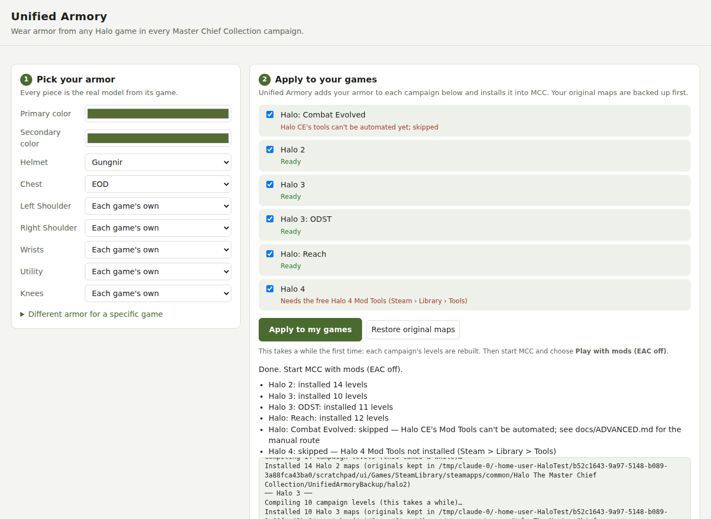

# Unified Armory

Wear armor from **any** Halo game in **every** Halo: The Master Chief Collection campaign. For example: Reach's Gungnir helmet and Halo 3's EOD chest on the Chief in Halo 2, ODST and Halo 4.

These are the real models from each game, fitted to every campaign's character.

## Install

1. **Download** `UnifiedArmory.zip` from the [Releases page](../../releases) and unzip it anywhere.
2. **Get the free Mod Tools** in Steam: open **Library**, switch the dropdown to **Tools**, and install the Mod Tools for:
   - each campaign you want to change, and
   - each game your armor comes from (a Reach helmet needs *Halo: Reach Mod Tools*).

   Halo 4 also needs [Blender](https://www.blender.org/download/) (free).
3. **Double-click `UnifiedArmory.exe`.** It opens in your browser and finds MCC and the Mod Tools by itself.

## Use

1. **Pick your armor:** a helmet, chest, shoulders and so on, from any game, plus your colors.
2. Click **Apply to my games**. The first time takes a while (up to a few hours for every campaign), because each campaign's levels are rebuilt with your armor. You can leave it running.
3. Start MCC and choose **Play with mods (EAC off)**.

Change your mind? Pick new armor and click **Apply** again.
**Undo everything:** click **Restore original maps** (or use Steam → MCC → Properties → Installed Files → Verify integrity).

## Good to know

- **Campaigns only.** Online multiplayer and matchmaking use MCC's own armor menus, which mods can't change.
- **Your original maps are backed up** before anything is replaced.
- **Halo CE** campaigns can't be changed automatically yet, and CE armor pieces need a one-time manual step. The app tells you when something is skipped and why.
- **Untested on real game files.** This hasn't been run against the real Mod Tools or MCC yet, so the first runs may hit problems with a particular game. If one fails, the app shows the step that failed. Please [open an issue](../../issues) with that message.

Technical details, the command line and the manual Halo CE route are in [docs/ADVANCED.md](docs/ADVANCED.md).
